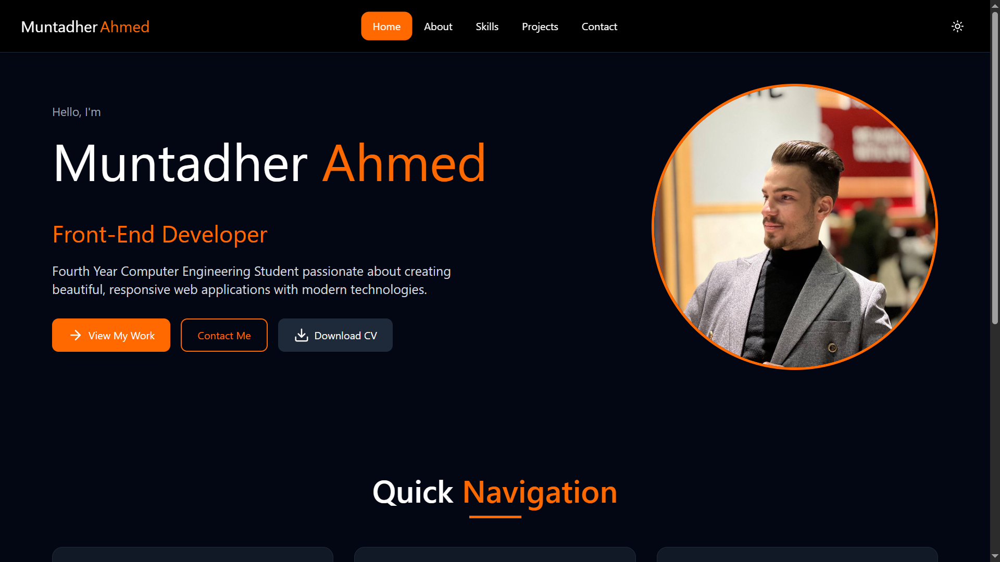
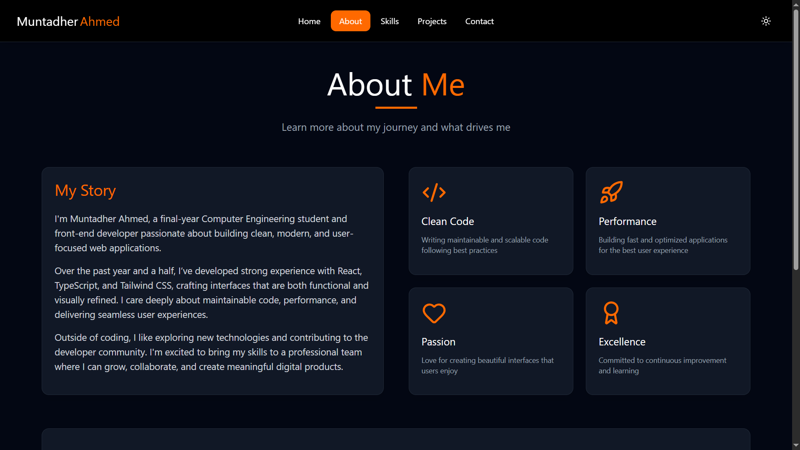
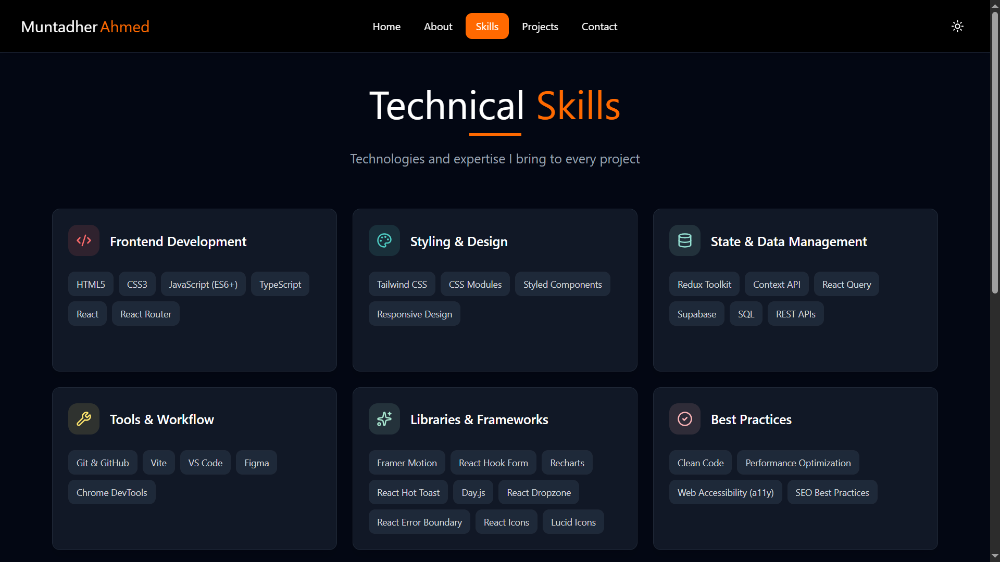
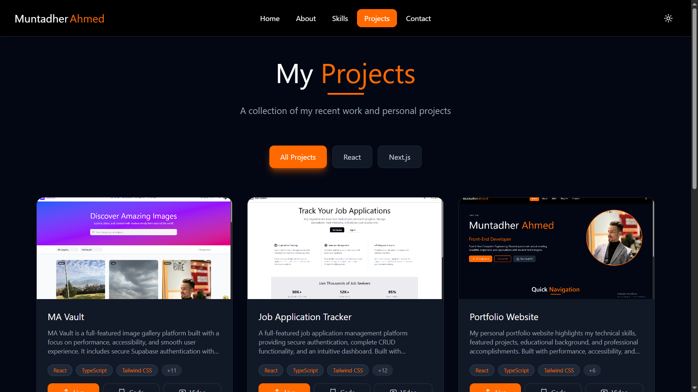
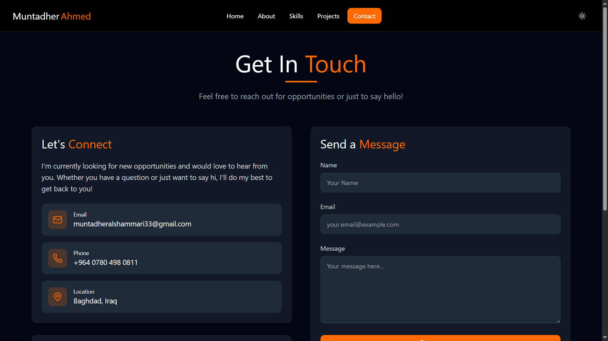
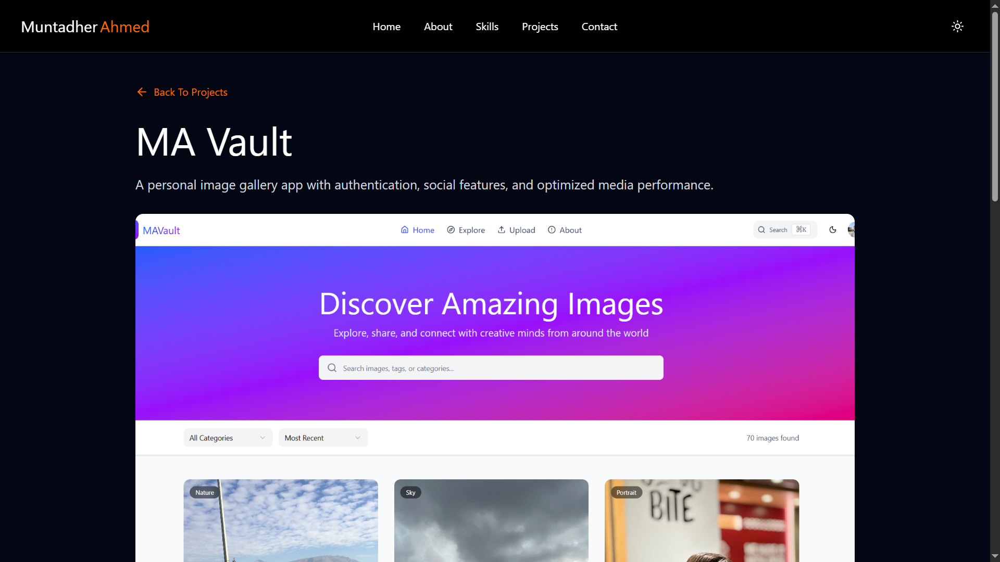

# Portfolio Website

_A modern showcase of my web development journey, skills, and projects._

**Live Demo:** [muntadher-ahmed.vercel.app](https://muntadher-ahmed.vercel.app)  
**Figma Design:** [Portfolio-App Figma](https://www.figma.com/design/1LNGOAX1BV4PI1sEHHiqBD/Portfolio-Web-App-Design?node-id=3-13162&m=dev)

**This Website** is my personal portfolio showcasing my journey as a **web developer**. It highlights my technical skills, featured projects, educational background, and professional accomplishments — all wrapped in a clean, responsive, and performant interface built with modern technologies.

---

## Tech Stack

- **React**
- **TypeScript**
- **Tailwind CSS**
- **React Router**
- **React Hot Toast**
- **Lucide Icons**
- **Framer Motion**
- **EmailJs**
- **React Error Boundary**

---

## Features

A portfolio designed with performance, accessibility, and user experience in mind.

- Fully responsive design optimized for all devices and screen sizes
- Interactive project showcase with live demos and source code links
- Comprehensive skills section with technology with categories for each
- Smooth page transitions and animations
- Contact form with form validation
- SEO optimized with meta tags and semantic HTML
- Ability to send an email directly from the website using EmailJs
- Dark theme support
- Custom error page for handling 404 errors and JS runtime errors

---

## Pages

- **Home** — Introduction and hero section
- **About** — My story, background, and what I do
- **Projects** — Showcase of featured work with descriptions
- **Project Details** — Showcase of details related to a project
- **Skills** — Technologies and tools I work with
- **Contact** — Get in touch section with contact form

_All pages are fully responsive and accessible._

**Want to see my projects in action?** Check out detailed walkthroughs on my [YouTube channel](https://youtube.com/@montadherahmed340?si=xJBcb4mffSJiOt-w)

---

## Screenshots

### Home Page



### About Page



### Skills Page



### Projects Page



### Contact Page



### Project Details Page



---

## Running Locally

To run this project locally, follow these steps:

```bash
# 1. Clone the repository and navigate into it
git clone https://github.com/Eng-Muntadher/Portfolio-App.git
cd portfolio-website

# 2. Install dependencies
npm install      # or yarn install / pnpm install

# 3. Start the development server
npm start        # or yarn start / pnpm start

# 4. Open the app in your browser
# Default URL: http://localhost:3000/
```

---

## 📁 Project Structure

```
src/
├── assets/          # Images, icons, and static files
├── components/      # Reusable UI components
├── data/            # Data for projects, skills and 'about' info
├── hooks/           # Custom hooks used across the app
├── pages/           # Page components (Home, About, Projects, etc.)
├── types/           # Types used to describe the shape of data across the app
```

---

## About Me

I'm **Muntadher Ahmed**, a passionate web developer and a computer engineer dedicated to crafting beautiful, accessible, and performant web experiences. This portfolio represents my journey in web development — showcasing the projects I've built, the technologies I've used, and the continuous learning that drives my career forward.

**Get to know me:** [Watch my introduction](https://www.youtube.com/shorts/L7H_s2v_TY8?feature=share)

---

## Contact

**Muntadher Ahmed**

Feel free to reach out through the contact form on the website, explore my YouTube content, or connect with me on social media:

- LinkedIn: [linkedin](https://www.linkedin.com/in/muntadher-ahmed-4577b6333)
- GitHub: [Eng-Muntadher](https://github.com/Eng-Muntadher)
- Email: muntadheralshammari33@gmail.com
- YouTube: [Project Walkthroughs](https://youtube.com/@montadherahmed340?si=xJBcb4mffSJiOt-w)

---

## License

This project is licensed under the [MIT License](./LICENSE).

---

Built by Muntadher Ahmed
