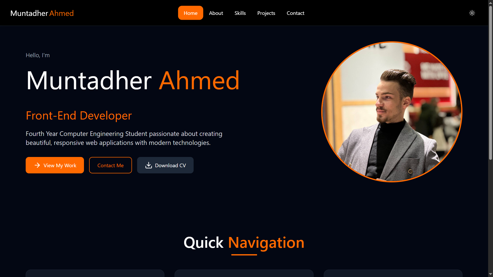
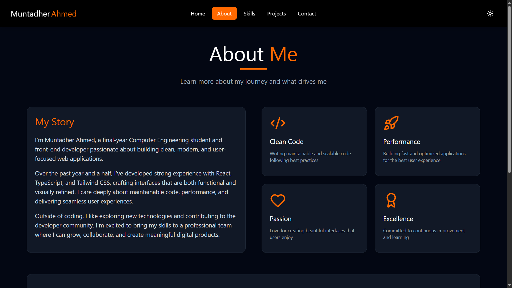
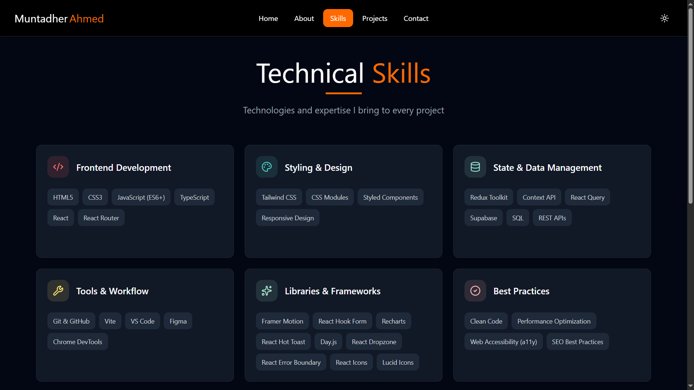
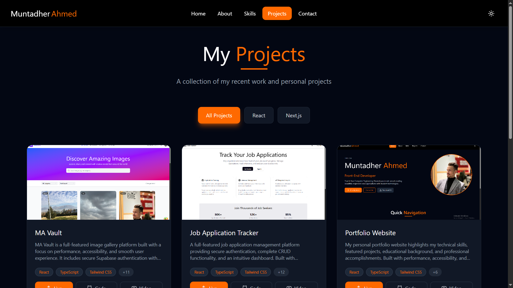
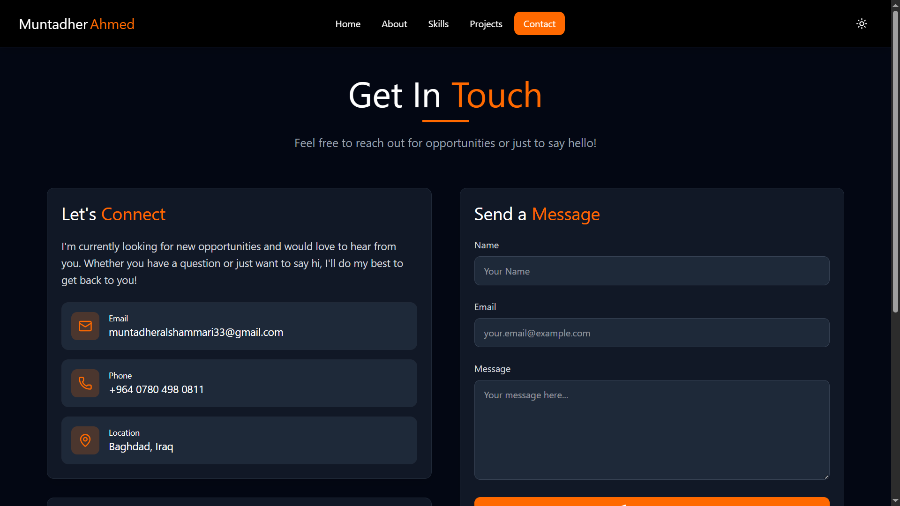
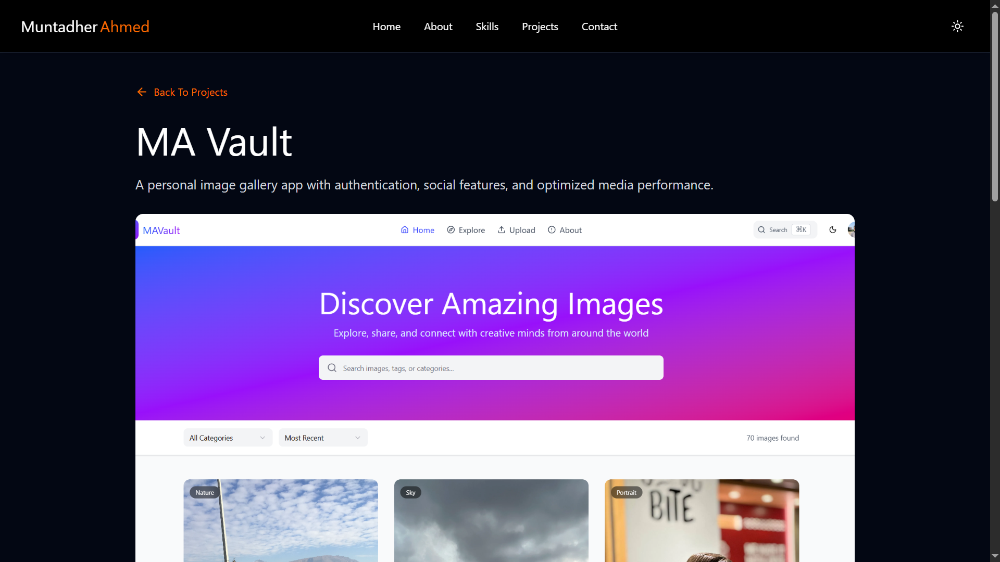

# Portfolio Website

_A modern showcase of my web development journey, skills, and projects._

**Live Demo:** [muntadher-ahmed.vercel.app](https://muntadher-ahmed.vercel.app)  
**Figma Design:** [Portfolio-App Figma](https://www.figma.com/design/1LNGOAX1BV4PI1sEHHiqBD/Portfolio-Web-App-Design?node-id=3-13162&m=dev)

**This Website** is my personal portfolio showcasing my journey as a **web developer**. It highlights my technical skills, featured projects, educational background, and professional accomplishments — all wrapped in a clean, responsive, and performant interface built with modern technologies.

> **Note:** This project was originally built with **React** and has been upgraded to **Next.js** for SEO and SSR.
>
> - The **current `main` branch** contains the Next.js version after merge.
> - The original React version can be viewed in the project's **commit history**.

---

## Tech Stack

- **Next.js**
- **TypeScript**
- **Tailwind CSS**
- **React Hot Toast**
- **Lucide Icons**
- **Framer Motion**
- **EmailJs**

---

## Features

A portfolio designed with performance, accessibility, and user experience in mind.

- Fully responsive design optimized for all devices and screen sizes
- Interactive project showcase with live demos, source code, and Figma design links
- Comprehensive skills section with technology with categories for each
- Smooth page transitions and animations with Framer Motion
- Contact form with form validation
- Ability to send an email directly from the website using EmailJs
- SEO optimized code with meta tags and semantic HTML
- Dark theme support
- Custom error and not-found pages for handling 404 and JS runtime errors

---

## Pages

- **Home** — Introduction and hero section
- **About** — My story, background, and what I do
- **Projects** — Showcase of featured work with descriptions
- **Project Details** — Showcase of details related to a project
- **Skills** — Technologies and tools I work with
- **not-found** — A page to catch all 404 errors
- **error** — A page to catch all runtime errors

_All pages are fully responsive and accessible._

**Want to see my projects in action?** Check out detailed walkthroughs on my [YouTube channel](https://youtube.com/@montadherahmed340?si=xJBcb4mffSJiOt-w)

---

## 📁 Project Structure (simplified)

```
portfolio-next/
├── src/
│   ├── app/
│   │   ├── _components/          # Reusable UI components (Header, Footer, ProjectCard, etc.)
│   │   ├── _data/                # Static data (projects list, skills, social links)
│   │   ├── _hooks/               # Custom React hooks
│   │   ├── _types/               # TypeScript type definitions and interfaces
│   │   ├── globals.css           # Global styles, CSS variables, and error page animations
│   │   ├── layout.tsx            # Root layout component (SEO metadata, theme setup)
│   │   ├── page.tsx              # Root page (redirects to homepage)
│   │   ├── not-found.tsx         # 404 Page - Catches all non-existent routes at root level
│   │   ├── error.tsx             # Error Boundary - Catches runtime errors across all pages
│   │   ├── global-error.tsx      # Root Error Boundary - Catches critical app-level errors
│   │   ├── sitemap.ts            # Auto-generated sitemap for SEO
│   │   ├── about/                # About page route
│   │   │   └── page.tsx
│   │   ├── home/                 # Home page route
│   │   │   └── page.tsx
│   │   ├── contact/              # Contact page route
│   │   │   └── page.tsx
│   │   ├── projects/             # Projects listing page
│   │   │   ├── page.tsx
│   │   │   └── [slug]/           # Dynamic route for individual project details
│   │   │       └── page.tsx
│   │   └── skills/               # Skills page route
│   │       └── page.tsx
├── public/                       # Static assets (images, icons, resume)
│   ├── favicon.svg               # App icon (150x150, scales to all sizes)
│   ├── myImg.png                 # Social sharing image (1200x630 for OG tags)
│   ├── site.webmanifest          # PWA manifest for installability
│   ├── robots.txt                # Search engine crawling rules
│   └── ...                       # Other assets (project images, resume, etc.)
└── ...                           # Config files (next.config.js, tsconfig.json, etc.)
```

---

## Screenshots

### Home Page



### About Page



### Skills Page



### Projects Page



### Contact Page



### Project Details Page



---

## Running Locally

To run this project locally, follow these steps:

```bash
# 1. Clone the repository and navigate into it
git clone https://github.com/Eng-Muntadher/Portfolio-App.git
cd portfolio-website

# 2. Install dependencies
npm install      # or yarn install / pnpm install

# 3. Start the development server
npm start        # or yarn start / pnpm start

# 4. Open the app in your browser
# Default URL: http://localhost:3000/
```

---

## About Me

I'm **Muntadher Ahmed**, a passionate web developer and a computer engineer dedicated to crafting beautiful, accessible, and performant web experiences. This portfolio represents my journey in web development — showcasing the projects I've built, the technologies I've used, and the continuous learning that drives my career forward.

**Get to know me:** [Watch my introduction](https://www.youtube.com/shorts/L7H_s2v_TY8?feature=share)

---

## Contact

**Muntadher Ahmed**

Feel free to reach out through the contact form on the website, explore my YouTube content, or connect with me on social media:

- LinkedIn: [linkedin](https://www.linkedin.com/in/muntadher-ahmed-4577b6333)
- GitHub: [Eng-Muntadher](https://github.com/Eng-Muntadher)
- Email: muntadheralshammari33@gmail.com
- YouTube: [Project Walkthroughs](https://youtube.com/@montadherahmed340?si=xJBcb4mffSJiOt-w)

---

## License

This project is licensed under the [MIT License](./LICENSE).

---

Built by Muntadher Ahmed
